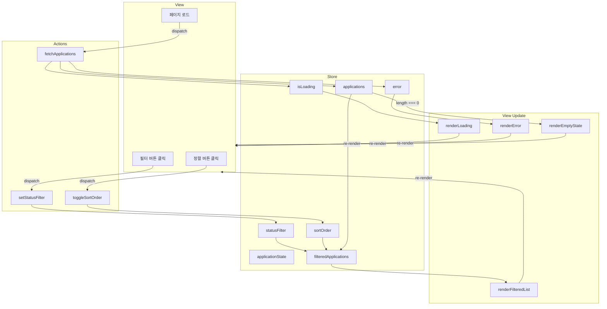
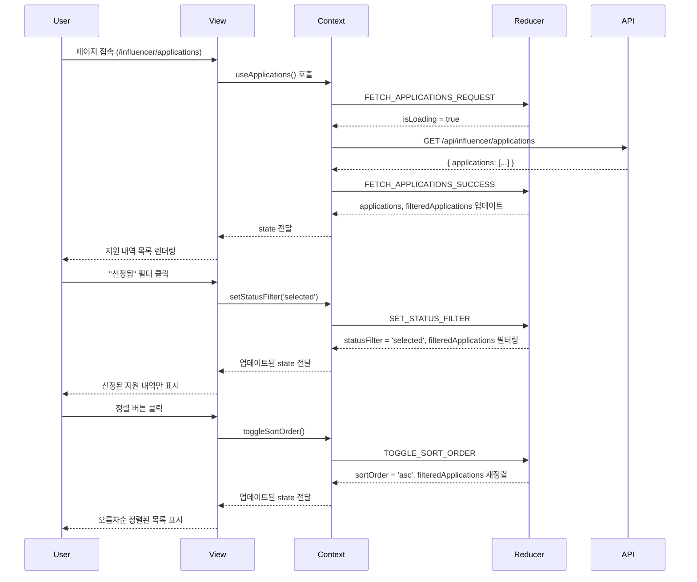

# 지원 내역 조회 페이지 상태관리 설계
## UC-011: 인플루언서 지원 내역 조회

## 페이지 개요

- **URL**: `/influencer/applications` 또는 `/influencer/profile`
- **권한**: 인플루언서 (정보 등록 완료)
- **목적**: 인플루언서가 지원한 체험단 목록 조회 및 상태별 필터링

---

## 상태관리 필요 여부

✅ **필요** - 상태별 필터링, 정렬 기능

**근거**:
- 상태별 필터링 (전체/지원완료/선정됨/탈락) → 클라이언트 측 필터 처리
- 정렬 기능 (최신순) → 클라이언트 측 정렬 처리
- 사용자 인터랙션에 따른 동적 UI 업데이트

---

## 1. 상태 데이터 목록

### 1.1 관리해야 할 상태 (State)

| 상태명 | 타입 | 초기값 | 설명 |
|--------|------|--------|------|
| `applications` | Array | `[]` | 지원 내역 목록 (전체 데이터) |
| `filteredApplications` | Array | `[]` | 필터링된 지원 내역 목록 (화면 표시용) |
| `statusFilter` | String | `'all'` | 현재 선택된 상태 필터 ('all', 'applied', 'selected', 'rejected') |
| `sortOrder` | String | `'desc'` | 정렬 순서 ('desc': 최신순, 'asc': 오래된순) |
| `isLoading` | Boolean | `false` | 데이터 로딩 상태 |
| `error` | String \| null | `null` | 에러 메시지 |
| `statusCounts` | Object | `{ applied: 0, selected: 0, rejected: 0 }` | 상태별 지원 내역 개수 |

### 1.2 화면에 보이지만 상태가 아닌 데이터

| 데이터명 | 설명 | 관리 방법 |
|---------|------|-----------|
| **현재 날짜** | D-Day 계산에 사용 | 렌더링 시점에 계산 |
| **날짜 포맷** | 지원일시 포맷 (예: "2025-11-14 12:00") | 유틸리티 함수로 변환 |
| **상태 배지 색상** | 지원완료(파란색), 선정됨(초록색), 탈락(회색) | CSS 클래스로 관리 |
| **체험단 링크** | `/campaign/{campaign_id}` | 데이터 기반 동적 생성 |
| **총 지원 내역 수** | `applications.length` | 파생 데이터 (계산) |

---

## 2. 상태 변경 조건 및 화면 변화

### 2.1 상태별 필터 변경

| 상태 변경 | 변경 조건 | 화면 변화 |
|----------|----------|----------|
| `statusFilter: 'all' → 'applied'` | "지원완료" 필터 클릭 | `filteredApplications`가 `status === 'APPLIED'`인 항목만 표시 |
| `statusFilter: 'all' → 'selected'` | "선정됨" 필터 클릭 | `filteredApplications`가 `status === 'SELECTED'`인 항목만 표시 |
| `statusFilter: 'all' → 'rejected'` | "탈락" 필터 클릭 | `filteredApplications`가 `status === 'REJECTED'`인 항목만 표시 |
| `statusFilter: 'applied' → 'all'` | "전체" 필터 클릭 | `filteredApplications`가 전체 데이터 표시 |

**UI 변화**:
- 선택된 필터 버튼: Active 상태 (파란색 배경)
- 지원 내역 목록: 필터링된 항목만 표시
- "검색 결과 없음" 메시지: `filteredApplications.length === 0`일 때 표시

---

### 2.2 정렬 순서 변경

| 상태 변경 | 변경 조건 | 화면 변화 |
|----------|----------|----------|
| `sortOrder: 'desc' → 'asc'` | 정렬 버튼 클릭 (최신순 → 오래된순) | `filteredApplications` 오름차순 정렬 (오래된 지원 내역부터) |
| `sortOrder: 'asc' → 'desc'` | 정렬 버튼 클릭 (오래된순 → 최신순) | `filteredApplications` 내림차순 정렬 (최신 지원 내역부터) |

**UI 변화**:
- 정렬 버튼 아이콘 변경 (▲/▼)
- 지원 내역 목록 순서 변경

---

### 2.3 데이터 로딩 상태

| 상태 변경 | 변경 조건 | 화면 변화 |
|----------|----------|----------|
| `isLoading: false → true` | 페이지 로드 시작 또는 필터 변경 시 | 로딩 스피너 표시, 지원 내역 목록 숨김 |
| `isLoading: true → false` | 데이터 조회 완료 | 로딩 스피너 숨김, 지원 내역 목록 표시 |

**UI 변화**:
- 로딩 중: `<div class="spinner-border"></div>` 표시
- 로딩 완료: 지원 내역 카드 목록 표시

---

### 2.4 에러 상태

| 상태 변경 | 변경 조건 | 화면 변화 |
|----------|----------|----------|
| `error: null → "에러 메시지"` | DB 조회 실패 또는 네트워크 오류 | 에러 메시지 알림 표시 |
| `error: "에러 메시지" → null` | 재시도 또는 페이지 새로고침 | 에러 메시지 숨김 |

**UI 변화**:
- 에러 발생: `<div class="alert alert-danger">일시적인 오류가 발생했습니다</div>`
- 에러 해결: 정상 목록 표시

---

### 2.5 지원 내역 없음

| 상태 | 조건 | 화면 변화 |
|------|------|----------|
| 지원 내역 없음 | `applications.length === 0` | "아직 지원한 체험단이 없습니다" 메시지, "체험단 탐색하기" 버튼 표시 |

---

## 3. Flux 패턴 상태 흐름 (Mermaid)



---

## 4. 상태 관리 설계 (Context + useReducer)

### 4.1 상태 구조 (State Shape)

```javascript
const initialState = {
  // 데이터
  applications: [],           // 전체 지원 내역 (서버에서 조회)
  filteredApplications: [],   // 필터링된 지원 내역 (화면 표시용)

  // 필터/정렬
  statusFilter: 'all',        // 'all' | 'applied' | 'selected' | 'rejected'
  sortOrder: 'desc',          // 'desc' | 'asc'

  // UI 상태
  isLoading: false,           // 로딩 중
  error: null,                // 에러 메시지

  // 통계
  statusCounts: {
    applied: 0,
    selected: 0,
    rejected: 0
  }
};
```

---

### 4.2 액션 타입 (Action Types)

```javascript
const ActionTypes = {
  // 데이터 조회
  FETCH_APPLICATIONS_REQUEST: 'FETCH_APPLICATIONS_REQUEST',
  FETCH_APPLICATIONS_SUCCESS: 'FETCH_APPLICATIONS_SUCCESS',
  FETCH_APPLICATIONS_FAILURE: 'FETCH_APPLICATIONS_FAILURE',

  // 필터/정렬
  SET_STATUS_FILTER: 'SET_STATUS_FILTER',
  TOGGLE_SORT_ORDER: 'TOGGLE_SORT_ORDER',

  // 리셋
  RESET_STATE: 'RESET_STATE'
};
```

---

### 4.3 Reducer 함수

```javascript
function applicationReducer(state, action) {
  switch (action.type) {
    case ActionTypes.FETCH_APPLICATIONS_REQUEST:
      return {
        ...state,
        isLoading: true,
        error: null
      };

    case ActionTypes.FETCH_APPLICATIONS_SUCCESS:
      const { applications } = action.payload;

      // 상태별 개수 계산
      const statusCounts = applications.reduce(
        (acc, app) => {
          const status = app.status.toLowerCase();
          if (status === 'applied') acc.applied++;
          if (status === 'selected') acc.selected++;
          if (status === 'rejected') acc.rejected++;
          return acc;
        },
        { applied: 0, selected: 0, rejected: 0 }
      );

      return {
        ...state,
        applications,
        filteredApplications: filterAndSortApplications(
          applications,
          state.statusFilter,
          state.sortOrder
        ),
        statusCounts,
        isLoading: false,
        error: null
      };

    case ActionTypes.FETCH_APPLICATIONS_FAILURE:
      return {
        ...state,
        isLoading: false,
        error: action.payload.error
      };

    case ActionTypes.SET_STATUS_FILTER:
      const newStatusFilter = action.payload.statusFilter;
      return {
        ...state,
        statusFilter: newStatusFilter,
        filteredApplications: filterAndSortApplications(
          state.applications,
          newStatusFilter,
          state.sortOrder
        )
      };

    case ActionTypes.TOGGLE_SORT_ORDER:
      const newSortOrder = state.sortOrder === 'desc' ? 'asc' : 'desc';
      return {
        ...state,
        sortOrder: newSortOrder,
        filteredApplications: filterAndSortApplications(
          state.applications,
          state.statusFilter,
          newSortOrder
        )
      };

    case ActionTypes.RESET_STATE:
      return initialState;

    default:
      return state;
  }
}

// 필터링 및 정렬 헬퍼 함수
function filterAndSortApplications(applications, statusFilter, sortOrder) {
  // 1. 상태 필터링
  let filtered = applications;
  if (statusFilter !== 'all') {
    const targetStatus = statusFilter.toUpperCase();
    filtered = applications.filter(app => app.status === targetStatus);
  }

  // 2. 정렬 (applied_at 기준)
  const sorted = [...filtered].sort((a, b) => {
    const dateA = new Date(a.applied_at);
    const dateB = new Date(b.applied_at);

    return sortOrder === 'desc' ? dateB - dateA : dateA - dateB;
  });

  return sorted;
}
```

---

### 4.4 Context Provider

```javascript
// ApplicationsContext.js
import React, { createContext, useContext, useReducer, useEffect } from 'react';

const ApplicationsContext = createContext(null);

export function ApplicationsProvider({ children }) {
  const [state, dispatch] = useReducer(applicationReducer, initialState);

  // 지원 내역 조회 (비동기)
  async function fetchApplications() {
    dispatch({ type: ActionTypes.FETCH_APPLICATIONS_REQUEST });

    try {
      const response = await fetch('/api/influencer/applications', {
        method: 'GET',
        headers: {
          'Content-Type': 'application/json'
        }
      });

      if (!response.ok) {
        if (response.status === 403) {
          throw new Error('인플루언서 권한이 필요합니다.');
        }
        throw new Error('지원 내역을 불러오는데 실패했습니다.');
      }

      const data = await response.json();

      dispatch({
        type: ActionTypes.FETCH_APPLICATIONS_SUCCESS,
        payload: { applications: data.applications }
      });

    } catch (error) {
      dispatch({
        type: ActionTypes.FETCH_APPLICATIONS_FAILURE,
        payload: { error: error.message }
      });
    }
  }

  // 상태 필터 변경
  function setStatusFilter(statusFilter) {
    dispatch({
      type: ActionTypes.SET_STATUS_FILTER,
      payload: { statusFilter }
    });
  }

  // 정렬 순서 토글
  function toggleSortOrder() {
    dispatch({ type: ActionTypes.TOGGLE_SORT_ORDER });
  }

  // 컴포넌트 마운트 시 데이터 조회
  useEffect(() => {
    fetchApplications();
  }, []);

  const value = {
    // State
    ...state,

    // Actions
    fetchApplications,
    setStatusFilter,
    toggleSortOrder
  };

  return (
    <ApplicationsContext.Provider value={value}>
      {children}
    </ApplicationsContext.Provider>
  );
}

// Custom Hook
export function useApplications() {
  const context = useContext(ApplicationsContext);
  if (!context) {
    throw new Error('useApplications must be used within ApplicationsProvider');
  }
  return context;
}
```

---

## 5. Context가 하위 컴포넌트에 노출하는 인터페이스

### 5.1 노출 변수 (State)

| 변수명 | 타입 | 설명 |
|--------|------|------|
| `applications` | `Array<Application>` | 전체 지원 내역 목록 |
| `filteredApplications` | `Array<Application>` | 필터링/정렬된 지원 내역 목록 (화면 표시용) |
| `statusFilter` | `'all' \| 'applied' \| 'selected' \| 'rejected'` | 현재 선택된 상태 필터 |
| `sortOrder` | `'desc' \| 'asc'` | 정렬 순서 (내림차순/오름차순) |
| `isLoading` | `Boolean` | 로딩 상태 |
| `error` | `String \| null` | 에러 메시지 |
| `statusCounts` | `{ applied: Number, selected: Number, rejected: Number }` | 상태별 지원 내역 개수 |

---

### 5.2 노출 함수 (Actions)

| 함수명 | 파라미터 | 반환값 | 설명 |
|--------|---------|--------|------|
| `fetchApplications()` | 없음 | `Promise<void>` | 서버에서 지원 내역 목록 조회 |
| `setStatusFilter(filter)` | `filter: String` | `void` | 상태 필터 변경 ('all', 'applied', 'selected', 'rejected') |
| `toggleSortOrder()` | 없음 | `void` | 정렬 순서 토글 (desc ↔ asc) |

---

### 5.3 Application 데이터 타입

```typescript
interface Application {
  id: number;
  status: 'APPLIED' | 'SELECTED' | 'REJECTED';
  applied_at: string; // ISO 8601 datetime (예: "2025-11-14T12:00:00Z")
  campaign: {
    id: number;
    title: string;
    end_date: string; // ISO 8601 date (예: "2025-11-30")
    status: 'RECRUITING' | 'CLOSED' | 'SELECTED';
  };
  advertiser: {
    business_name: string;
  };
}
```

---

## 6. 데이터 흐름 시각화



---

## 7. 컴포넌트 구조 (Flask + Jinja2 + Vanilla JS)

### 7.1 서버 사이드 (Flask + Jinja2)

**Route**: `/influencer/applications`

```python
@influencer_bp.route('/applications', methods=['GET'])
@login_required
@influencer_required
def applications():
    """지원 내역 조회 페이지"""
    # ApplicationService를 통해 지원 내역 조회
    influencer_id = get_current_influencer_id()
    applications = application_service.get_applications_by_influencer(influencer_id)

    # 상태별 개수 계산
    status_counts = {
        'applied': sum(1 for app in applications if app.status == 'APPLIED'),
        'selected': sum(1 for app in applications if app.status == 'SELECTED'),
        'rejected': sum(1 for app in applications if app.status == 'REJECTED')
    }

    return render_template(
        'influencer/applications.html',
        applications=applications,
        status_counts=status_counts
    )
```

---

### 7.2 클라이언트 사이드 (Vanilla JS)

**파일**: `/static/js/applications.js`

```javascript
// 상태 관리
const state = {
  applications: [],           // 초기 데이터는 Jinja2에서 주입
  filteredApplications: [],
  statusFilter: 'all',
  sortOrder: 'desc'
};

// 초기화
function init() {
  // Jinja2에서 주입된 데이터 파싱
  state.applications = JSON.parse(
    document.getElementById('applications-data').textContent
  );

  // 초기 필터링/정렬
  updateFilteredApplications();

  // 이벤트 리스너 등록
  registerEventListeners();
}

// 필터링 및 정렬
function updateFilteredApplications() {
  let filtered = state.applications;

  // 1. 상태 필터링
  if (state.statusFilter !== 'all') {
    const targetStatus = state.statusFilter.toUpperCase();
    filtered = filtered.filter(app => app.status === targetStatus);
  }

  // 2. 정렬
  const sorted = [...filtered].sort((a, b) => {
    const dateA = new Date(a.applied_at);
    const dateB = new Date(b.applied_at);
    return state.sortOrder === 'desc' ? dateB - dateA : dateA - dateB;
  });

  state.filteredApplications = sorted;
  render();
}

// 렌더링
function render() {
  renderApplicationList();
  renderFilterButtons();
  renderSortButton();
}

// 이벤트 리스너
function registerEventListeners() {
  // 필터 버튼
  document.querySelectorAll('.filter-button').forEach(button => {
    button.addEventListener('click', (e) => {
      state.statusFilter = e.target.dataset.filter;
      updateFilteredApplications();
    });
  });

  // 정렬 버튼
  document.getElementById('sort-button')?.addEventListener('click', () => {
    state.sortOrder = state.sortOrder === 'desc' ? 'asc' : 'desc';
    updateFilteredApplications();
  });
}

// DOMContentLoaded
document.addEventListener('DOMContentLoaded', init);
```

---

## 8. UI 컴포넌트별 책임

### 8.1 FilterButtons 컴포넌트

**책임**: 상태 필터 버튼 (전체/지원완료/선정됨/탈락) 렌더링

**사용 데이터**:
- `statusFilter` (현재 선택된 필터)
- `statusCounts` (각 상태별 개수)

**트리거 액션**:
- `setStatusFilter(filter)`

---

### 8.2 SortButton 컴포넌트

**책임**: 정렬 버튼 (최신순 ↔ 오래된순) 렌더링

**사용 데이터**:
- `sortOrder` (현재 정렬 순서)

**트리거 액션**:
- `toggleSortOrder()`

---

### 8.3 ApplicationList 컴포넌트

**책임**: 지원 내역 목록 렌더링

**사용 데이터**:
- `filteredApplications` (필터링된 지원 내역)
- `isLoading` (로딩 상태)
- `error` (에러 메시지)

**트리거 액션**: 없음 (읽기 전용)

---

### 8.4 ApplicationCard 컴포넌트

**책임**: 개별 지원 내역 카드 렌더링

**사용 데이터**:
- `application` (지원 내역 데이터)

**표시 정보**:
- 체험단 제목
- 광고주 업체명
- 지원 일시
- 선정 상태 배지
- "상세보기" 버튼

---

### 8.5 EmptyState 컴포넌트

**책임**: 지원 내역 없음 메시지 표시

**표시 조건**:
- `applications.length === 0`

**UI**:
- "아직 지원한 체험단이 없습니다" 메시지
- "체험단 탐색하기" 버튼 (홈으로 이동)

---

## 9. 성능 최적화

### 9.1 메모이제이션

```javascript
// 필터링/정렬 결과 캐싱
const cache = new Map();

function filterAndSortApplications(applications, statusFilter, sortOrder) {
  const cacheKey = `${statusFilter}-${sortOrder}`;

  if (cache.has(cacheKey)) {
    return cache.get(cacheKey);
  }

  const result = /* 필터링/정렬 로직 */;
  cache.set(cacheKey, result);
  return result;
}
```

---

### 9.2 가상 스크롤 (Phase 2)

지원 내역이 많을 경우 (100개 이상) 가상 스크롤 적용

---

## 10. 에러 처리

### 10.1 인증 오류

```javascript
// 403 Forbidden: 인플루언서 권한 없음
if (response.status === 403) {
  window.location.href = '/influencer/register?next=' + encodeURIComponent(window.location.pathname);
}
```

---

### 10.2 네트워크 오류

```javascript
catch (error) {
  if (error.name === 'NetworkError') {
    dispatch({
      type: ActionTypes.FETCH_APPLICATIONS_FAILURE,
      payload: { error: '네트워크 연결을 확인해주세요.' }
    });
  }
}
```

---

## 11. 테스트 시나리오

### 11.1 정상 조회
- **Given**: 인플루언서가 3개 체험단에 지원
- **When**: 페이지 로드
- **Then**: 3개의 지원 내역 표시 (최신순)

---

### 11.2 상태 필터링
- **Given**: 지원 내역 5개 (선정 2개, 탈락 3개)
- **When**: "선정됨" 필터 클릭
- **Then**: 선정된 2개만 표시

---

### 11.3 정렬 변경
- **Given**: 지원 내역 5개
- **When**: 정렬 버튼 클릭
- **Then**: 오래된순으로 재정렬

---

### 11.4 지원 내역 없음
- **Given**: 지원한 체험단 없음
- **When**: 페이지 로드
- **Then**: "아직 지원한 체험단이 없습니다" + "체험단 탐색하기" 버튼

---

## 12. 접근성 (Accessibility)

### 12.1 ARIA 속성

```html
<div role="region" aria-label="지원 내역 목록">
  <!-- 지원 내역 -->
</div>

<div role="tablist" aria-label="상태 필터">
  <button role="tab" aria-selected="true" aria-controls="application-list">
    전체
  </button>
</div>
```

---

### 12.2 키보드 네비게이션

- 필터 버튼: `Tab` 키로 이동, `Enter/Space`로 선택
- 정렬 버튼: `Tab` 키로 이동, `Enter/Space`로 토글

---

## 13. 향후 확장 가능성

### Phase 2 기능
- **실시간 업데이트**: WebSocket으로 선정 상태 변경 시 자동 갱신
- **페이지네이션**: 지원 내역이 많을 경우 페이지네이션 추가
- **검색 기능**: 체험단 제목으로 검색
- **날짜 범위 필터**: 지원 기간으로 필터링 (예: 최근 1개월)
- **CSV 내보내기**: 지원 내역 다운로드

---

## 참고 문서

- `docs/usecases/11/spec.md`: UC-011 지원 내역 조회 유스케이스
- `docs/prd.md`: PRD 문서 (Phase 2 feature)
- `docs/database.md`: Application 테이블 스키마
